# CI/CD Pipeline Documentation

This document explains the comprehensive CI/CD pipeline for deploying the Go API to Render using GitHub Actions.

## 🏗️ Pipeline Overview

The CI/CD pipeline is designed with security, performance, and reliability in mind, implementing industry best practices for Go applications.

### Pipeline Stages

```mermaid
graph LR
    A[Code Push] --> B[Test & Lint]
    B --> C[Security Scan]
    C --> D[Build Docker Image]
    D --> E[Deploy Staging]
    E --> F[Performance Test]
    F --> G[Deploy Production]
    G --> H[Cleanup]
    
    style A fill:#e1f5fe
    style B fill:#f3e5f5
    style C fill:#fff3e0
    style D fill:#e8f5e8
    style E fill:#fff8e1
    style F fill:#fce4ec
    style G fill:#e0f2f1
    style H fill:#f1f8e9
```



## 🔧 Pipeline Components

### 1. **Test and Lint Stage**
- **Go Version**: 1.21 (latest LTS)
- **Services**: Redis and MongoDB containers for integration tests
- **Coverage**: Generates test coverage reports
- **Linting**: Uses golangci-lint with comprehensive rules
- **Artifacts**: Coverage reports uploaded to Codecov

### 2. **Security Scanning**
- **Gosec**: Go security checker for code vulnerabilities
- **Trivy**: Container and filesystem vulnerability scanner
- **SARIF Upload**: Security results uploaded to GitHub Security tab
- **Dependency Check**: Validates go.mod dependencies

### 3. **Docker Build**
- **Multi-stage Build**: Optimized for production with minimal attack surface
- **Multi-platform**: Builds for AMD64 and ARM64 architectures
- **Image Registry**: GitHub Container Registry (ghcr.io)
- **Build Cache**: GitHub Actions cache for faster builds
- **SBOM**: Software Bill of Materials generated for compliance

### 4. **Deployment Stages**

#### Staging Deployment
- **Trigger**: Push to `develop` branch
- **Environment**: Staging environment on Render
- **Health Checks**: Automated health verification
- **Smoke Tests**: Basic functionality validation

#### Production Deployment
- **Trigger**: Push to `main` branch (after staging success)
- **Environment**: Production environment on Render
- **Health Checks**: Comprehensive health verification
- **Notifications**: Slack notifications for success/failure

### 5. **Performance Testing**
- **Tool**: k6 load testing framework
- **Scope**: API endpoints and cache performance
- **Metrics**: Response times, error rates, throughput
- **Artifacts**: Performance test results uploaded

### 6. **Cleanup**
- **Container Images**: Removes old images (keeps 5 latest)
- **Artifacts**: Cleans up temporary build artifacts
- **Resource Management**: Optimizes storage usage

## 🚀 Render Deployment Configuration

### Service Configuration (`render.yaml`)

```yaml
services:
  - type: web
    name: demo-go-api
    env: docker
    dockerfilePath: ./Dockerfile
    region: oregon
    plan: starter
    branch: main
    healthCheckPath: /health
```

### Environment Variables
- **Runtime Configuration**: PORT, ENVIRONMENT, LOG_LEVEL
- **Authentication**: JWT_SECRET (auto-generated)
- **Database**: MONGODB_URI (from managed database)
- **Cache**: REDIS_ADDRESS (from managed Redis)
- **Feature Flags**: CACHE_TYPE, REPOSITORY_TYPE

### Infrastructure Components
- **Web Service**: Go API application
- **MongoDB**: Managed database with automatic backups
- **Redis**: Managed cache with configurable eviction policy
- **Load Balancer**: Automatic SSL termination and routing

## 📊 Required GitHub Secrets

### Render Integration
```bash
RENDER_API_KEY=rnd_xxxxxxxxxxxxx
RENDER_STAGING_SERVICE_ID=srv-xxxxxxxxxxxxx
RENDER_PRODUCTION_SERVICE_ID=srv-xxxxxxxxxxxxx
```

### Environment URLs
```bash
STAGING_HEALTH_URL=https://demo-go-staging.onrender.com
PRODUCTION_HEALTH_URL=https://demo-go-api.onrender.com
```

### Notifications (Optional)
```bash
SLACK_WEBHOOK=https://hooks.slack.com/services/xxx/xxx/xxx
```

## 🔐 Security Features

### Container Security
- **Non-root User**: Application runs as non-privileged user
- **Minimal Base Image**: Alpine Linux for reduced attack surface
- **No Secrets in Image**: All secrets provided via environment variables
- **Health Checks**: Built-in container health monitoring

### Code Security
- **Static Analysis**: Gosec security scanner
- **Vulnerability Scanning**: Trivy for known CVEs
- **Dependency Scanning**: go mod verify and security advisories
- **SARIF Integration**: Security findings in GitHub Security tab

### Runtime Security
- **Environment Isolation**: Staging and production environments separated
- **Secret Management**: Render-managed secret generation and rotation
- **Network Security**: HTTPS-only communication
- **Resource Limits**: CPU and memory constraints

## 📈 Monitoring and Observability

### Build Metrics
- **Build Time**: Track build duration trends
- **Test Coverage**: Monitor code coverage changes
- **Security Issues**: Track security findings over time
- **Image Size**: Monitor container image size growth

### Deployment Metrics
- **Deployment Success Rate**: Track deployment reliability
- **Rollback Frequency**: Monitor deployment quality
- **Performance Regression**: Detect performance issues
- **Error Rates**: Monitor application health

### Performance Metrics
- **Response Times**: API endpoint performance
- **Cache Hit Rates**: Redis cache effectiveness
- **Database Performance**: MongoDB query performance
- **Resource Utilization**: CPU, memory, and disk usage

## 🔧 Local Development Setup

### Prerequisites
```bash
# Install required tools
go install github.com/golangci/golangci-lint/cmd/golangci-lint@latest
go install github.com/99designs/gqlgen@latest

# Install k6 for load testing
brew install k6  # macOS
# or
curl https://github.com/grafana/k6/releases/download/v0.46.0/k6-v0.46.0-linux-amd64.tar.gz | tar -xz --strip-components 1
```

### Running Tests Locally
```bash
# Unit tests
go test ./...

# With coverage
go test -cover ./...

# Linting
golangci-lint run

# Load testing (requires running server)
k6 run tests/load-test.js
```

### Docker Build Testing
```bash
# Build image locally
docker build -t demo-go-api .

# Run container
docker run -p 8080:8080 demo-go-api

# Test health endpoint
curl http://localhost:8080/health
```

## 🌟 Best Practices Implemented

### Code Quality
- **Comprehensive Testing**: Unit, integration, and load tests
- **Static Analysis**: Multiple linters and security scanners
- **Code Coverage**: Minimum coverage thresholds enforced
- **Dependency Management**: Verified and secure dependencies

### Security
- **Least Privilege**: Non-root container execution
- **Secret Management**: No hardcoded secrets or credentials
- **Vulnerability Scanning**: Automated security assessments
- **Compliance**: SBOM generation for audit requirements

### Performance
- **Optimized Builds**: Multi-stage Docker builds
- **Caching**: Build and dependency caching
- **Load Testing**: Automated performance validation
- **Resource Efficiency**: Minimal container footprint

### Reliability
- **Health Checks**: Application and container health monitoring
- **Graceful Degradation**: Fallback mechanisms for dependencies
- **Rollback Capability**: Quick rollback on deployment failures
- **Environment Parity**: Consistent staging and production setups

## 🚀 Deployment Process

### Automatic Deployment Flow

1. **Feature Development**
   ```bash
   git checkout -b feature/new-feature
   # Develop feature
   git push origin feature/new-feature
   # Create PR to develop
   ```

2. **Staging Deployment**
   ```bash
   git checkout develop
   git merge feature/new-feature
   git push origin develop
   # Automatic staging deployment triggered
   ```

3. **Production Deployment**
   ```bash
   git checkout main
   git merge develop
   git push origin main
   # Automatic production deployment triggered
   ```

### Manual Deployment (if needed)
```bash
# Using Render CLI
render deploy --service-id srv-xxxxxxxxxxxxx

# Using GitHub Actions manual trigger
# Go to Actions tab → Select workflow → Run workflow
```

## 📚 Troubleshooting

### Common Issues

#### Build Failures
```bash
# Check dependencies
go mod tidy
go mod verify

# Run tests locally
go test ./...

# Check linting
golangci-lint run
```

#### Deployment Failures
```bash
# Check Render logs
render logs --service-id srv-xxxxxxxxxxxxx --follow

# Verify health endpoint
curl -f https://your-app.onrender.com/health

# Check environment variables
render env list --service-id srv-xxxxxxxxxxxxx
```

#### Performance Issues
```bash
# Run load tests
k6 run tests/load-test.js

# Check cache performance
redis-cli info stats

# Monitor database performance
mongosh --eval "db.runCommand({serverStatus: 1})"
```

### Debugging Commands
```bash
# View pipeline logs
gh run list
gh run view <run-id>

# Check container status
docker ps
docker logs <container-id>

# Test API endpoints
curl -v https://your-app.onrender.com/api/v1/health
```

## 🎯 Performance Targets

### Build Performance
- **Build Time**: < 5 minutes for complete pipeline
- **Test Execution**: < 2 minutes for all tests
- **Image Size**: < 50MB for production image
- **Security Scan**: < 1 minute for vulnerability assessment

### Application Performance
- **Response Time**: < 100ms for cached requests
- **Throughput**: > 1000 requests/second
- **Error Rate**: < 0.1% for API endpoints
- **Cache Hit Rate**: > 90% for frequently accessed data

### Deployment Performance
- **Deployment Time**: < 3 minutes for complete deployment
- **Health Check**: < 30 seconds for service readiness
- **Rollback Time**: < 1 minute for emergency rollbacks
- **Zero Downtime**: Blue-green deployment strategy

---

🎉 **Your Go API now has enterprise-grade CI/CD pipeline with automated testing, security scanning, and deployment to Render!**
