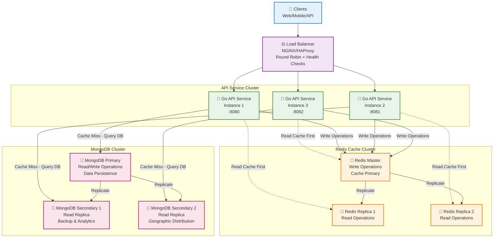
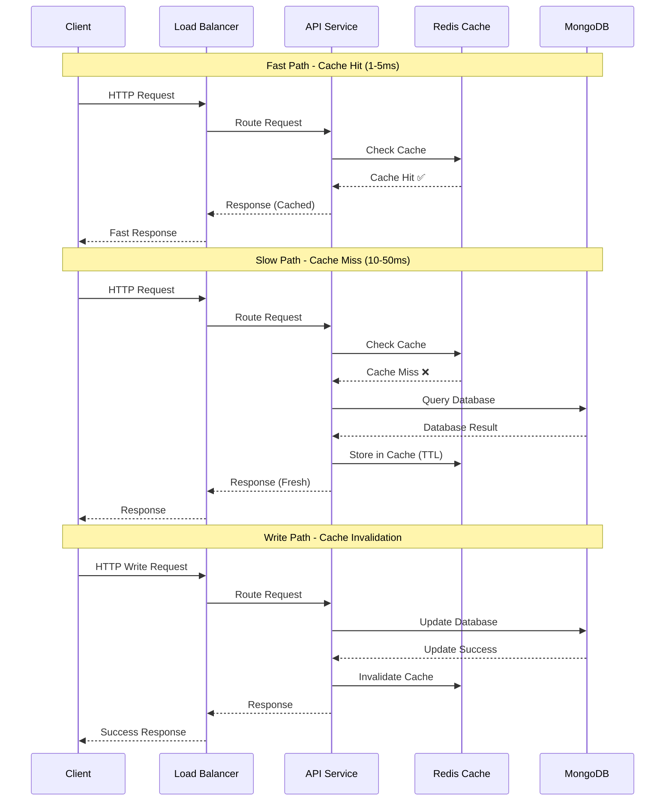
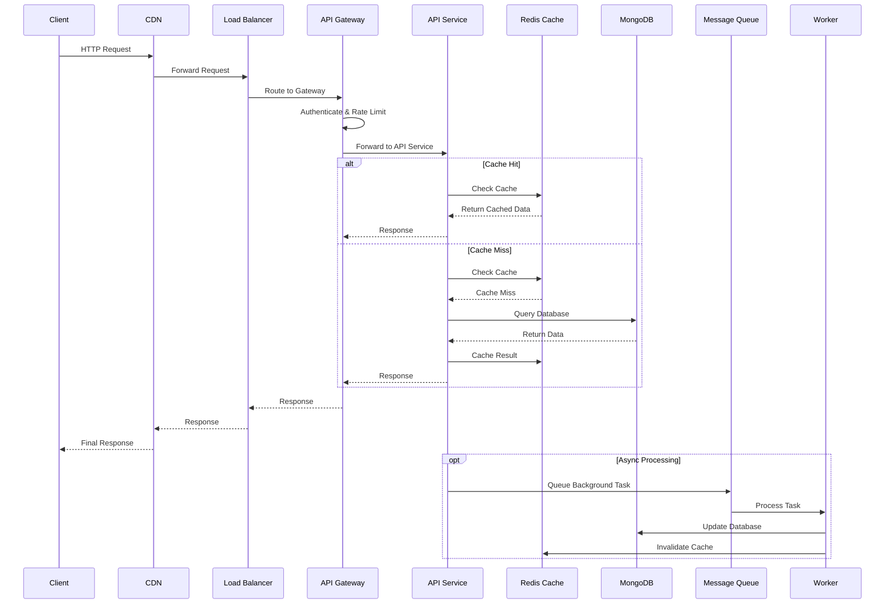
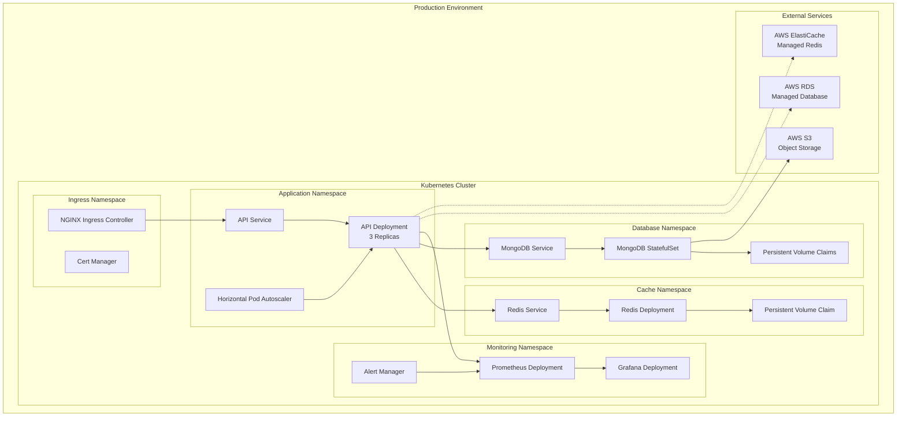

# Scalable Backend Architecture

This document outlines a production-ready, scalable backend architecture using load balancing, distributed caching, and database clustering.

## 🎯 Core Architecture - Simplified View



## 🔄 Data Flow Patterns



## 🏗️ Architecture Overview

```mermaid
graph TB
    %% External Layer
    subgraph "External Clients"
        WEB[🌐 Web Browser]
        MOBILE[📱 Mobile App]
        API_CLIENT[🔧 API Client]
        IOT[🏠 IoT Devices]
    end

    %% CDN Layer
    CDN[🚀 CDN/CloudFlare<br/>Global Edge Cache]

    %% Load Balancer Layer
    subgraph "Load Balancing Layer"
        LB[⚖️ Primary Load Balancer<br/>NGINX/HAProxy<br/>SSL Termination]
        LB_BACKUP[⚖️ Backup Load Balancer<br/>Keepalived HA]
        LB_HEALTH[💓 Health Check Service]
    end

    %% API Gateway Layer
    subgraph "API Gateway & Security Layer"
        GATEWAY[🚪 API Gateway<br/>Kong/Ambassador<br/>Request Routing]
        AUTH[🔐 Auth Service<br/>JWT/OAuth2<br/>Multi-Factor Auth]
        RATE_LIMIT[🚦 Rate Limiter<br/>DDoS Protection]
        WAF[🛡️ Web Application Firewall<br/>Attack Prevention]
    end

    %% Application Layer
    subgraph "Application Layer - Auto Scaling"
        subgraph "Go API Service Cluster"
            API1[🚀 Go API Service 1<br/>Port 8080<br/>User Management]
            API2[🚀 Go API Service 2<br/>Port 8081<br/>Business Logic]
            API3[🚀 Go API Service 3<br/>Port 8082<br/>Analytics]
            API4[🚀 Go API Service 4<br/>Port 8083<br/>Notifications]
        end
        
        subgraph "Service Mesh & Discovery"
            MESH[🕸️ Service Mesh<br/>Istio/Linkerd<br/>mTLS Communication]
            DISCOVERY[🔍 Service Discovery<br/>Consul/Eureka]
            CIRCUIT[⚡ Circuit Breaker<br/>Hystrix/Resilience4j]
        end
    end

    %% Caching Layer
    subgraph "Multi-Tier Caching Layer"
        subgraph "Redis Cluster - High Performance"
            REDIS_MASTER[🔴 Redis Master<br/>Primary Cache<br/>Write Operations]
            REDIS_SLAVE1[🔴 Redis Replica 1<br/>Read Cache<br/>Geographic East]
            REDIS_SLAVE2[🔴 Redis Replica 2<br/>Read Cache<br/>Geographic West]
            REDIS_SLAVE3[🔴 Redis Replica 3<br/>Read Cache<br/>Hot Standby]
        end
        
        subgraph "Cache Management"
            REDIS_SENTINEL[👁️ Redis Sentinel<br/>High Availability<br/>Automatic Failover]
            REDIS_PROXY[🔄 Redis Proxy<br/>Connection Pooling]
            CACHE_MONITOR[📊 Cache Monitor<br/>Performance Metrics]
        end
        
        subgraph "Additional Cache Layers"
            L1_CACHE[⚡ L1 Cache<br/>In-Memory<br/>Application Layer]
            L2_CACHE[💾 L2 Cache<br/>SSD Cache<br/>Node Local]
        end
    end

    %% Message Queue Layer
    subgraph "Message Queue Layer"
        QUEUE[Message Queue<br/>RabbitMQ/Apache Kafka]
        WORKER1[Background Worker 1]
        WORKER2[Background Worker 2]
    end

    %% Database Layer
    subgraph "Database Layer - Distributed & Scalable"
        subgraph "MongoDB Cluster - Sharded"
            subgraph "Shard 1"
                MONGO_P1[🍃 MongoDB Primary 1<br/>Shard A<br/>Users 0-33%]
                MONGO_S1A[🍃 MongoDB Secondary 1A<br/>Replica]
                MONGO_S1B[🍃 MongoDB Secondary 1B<br/>Replica]
            end
            
            subgraph "Shard 2"
                MONGO_P2[🍃 MongoDB Primary 2<br/>Shard B<br/>Users 34-66%]
                MONGO_S2A[🍃 MongoDB Secondary 2A<br/>Replica]
                MONGO_S2B[🍃 MongoDB Secondary 2B<br/>Replica]
            end
            
            subgraph "Shard 3"
                MONGO_P3[🍃 MongoDB Primary 3<br/>Shard C<br/>Users 67-100%]
                MONGO_S3A[🍃 MongoDB Secondary 3A<br/>Replica]
                MONGO_S3B[🍃 MongoDB Secondary 3B<br/>Replica]
            end
            
            MONGO_CONFIG[⚙️ MongoDB Config Servers<br/>Metadata & Routing]
            MONGO_ROUTER[🗺️ MongoDB Router (mongos)<br/>Query Distribution]
        end
        
        subgraph "Database Operations & Backup"
            BACKUP_S3[☁️ S3 Backup Storage<br/>Multi-Region<br/>Point-in-Time Recovery]
            BACKUP_SCHEDULE[⏰ Automated Backups<br/>Daily/Hourly<br/>Retention Policy]
            DB_MONITOR[📈 Database Monitor<br/>Performance Tuning]
            READ_REPLICA[📖 Read Replicas<br/>Analytics Workload]
        end
    end

    %% Monitoring Layer
    subgraph "Monitoring & Observability"
        PROMETHEUS[Prometheus<br/>Metrics Collection]
        GRAFANA[Grafana<br/>Dashboards]
        JAEGER[Jaeger<br/>Distributed Tracing]
        ELK[ELK Stack<br/>Log Aggregation]
    end

    %% Security Layer
    subgraph "Security Layer"
        WAF[Web Application Firewall]
        VAULT[HashiCorp Vault<br/>Secrets Management]
        CERT[SSL/TLS Certificates]
    end

    %% Connections
    WEB --> CDN
    MOBILE --> CDN
    API_CLIENT --> CDN
    
    CDN --> WAF
    WAF --> LB
    LB -.-> LB_BACKUP
    
    LB --> GATEWAY
    GATEWAY --> AUTH
    GATEWAY --> RATE_LIMIT
    
    GATEWAY --> MESH
    MESH --> API1
    MESH --> API2
    MESH --> API3
    
    API1 --> REDIS_MASTER
    API2 --> REDIS_MASTER
    API3 --> REDIS_MASTER
    
    API1 --> REDIS_SLAVE1
    API2 --> REDIS_SLAVE2
    API3 --> REDIS_SLAVE1
    
    REDIS_MASTER --> REDIS_SLAVE1
    REDIS_MASTER --> REDIS_SLAVE2
    REDIS_SENTINEL --> REDIS_MASTER
    REDIS_SENTINEL --> REDIS_SLAVE1
    REDIS_SENTINEL --> REDIS_SLAVE2
    
    API1 --> MONGO_PRIMARY
    API2 --> MONGO_SECONDARY1
    API3 --> MONGO_SECONDARY2
    
    MONGO_PRIMARY --> MONGO_SECONDARY1
    MONGO_PRIMARY --> MONGO_SECONDARY2
    MONGO_PRIMARY -.-> MONGO_ARBITER
    
    API1 --> QUEUE
    API2 --> QUEUE
    API3 --> QUEUE
    
    QUEUE --> WORKER1
    QUEUE --> WORKER2
    
    WORKER1 --> MONGO_PRIMARY
    WORKER2 --> MONGO_PRIMARY
    
    MONGO_PRIMARY --> BACKUP_S3
    BACKUP_SCHEDULE --> BACKUP_S3
    
    API1 --> PROMETHEUS
    API2 --> PROMETHEUS
    API3 --> PROMETHEUS
    
    PROMETHEUS --> GRAFANA
    API1 --> JAEGER
    API2 --> JAEGER
    API3 --> JAEGER
    
    API1 --> ELK
    API2 --> ELK
    API3 --> ELK
    
    AUTH --> VAULT
    API1 --> VAULT
    API2 --> VAULT
    API3 --> VAULT

    %% Styling
    classDef client fill:#e1f5fe
    classDef lb fill:#f3e5f5
    classDef api fill:#e8f5e8
    classDef cache fill:#fff3e0
    classDef db fill:#fce4ec
    classDef monitor fill:#f1f8e9
    classDef security fill:#ffebee
    classDef queue fill:#e0f2f1

    class WEB,MOBILE,API_CLIENT,IOT client
    class LB,LB_BACKUP,GATEWAY lb
    class API1,API2,API3,API4,MESH api
    class REDIS_MASTER,REDIS_SLAVE1,REDIS_SLAVE2,REDIS_SLAVE3,REDIS_SENTINEL cache
    class MONGO_P1,MONGO_P2,MONGO_P3,MONGO_S1A,MONGO_S1B,MONGO_S2A,MONGO_S2B,MONGO_S3A,MONGO_S3B,BACKUP_S3,BACKUP_SCHEDULE db
    class PROMETHEUS,GRAFANA,JAEGER,ELK monitor
    class WAF,VAULT,CERT,AUTH security
    class QUEUE,WORKER1,WORKER2 queue
```

## 🏢 Enterprise Architecture - Complete View

```mermaid
graph TB
    %% Internet Gateway
    INTERNET[🌍 Internet<br/>Global Users]
    
    %% Edge Layer
    subgraph "Edge Infrastructure"
        CDN[🚀 CDN Network<br/>CloudFlare/AWS CloudFront<br/>Global Edge Locations]
        WAF[🛡️ Web Application Firewall<br/>DDoS Protection<br/>Attack Mitigation]
        DNS[🌐 DNS & Route 53<br/>Geographic Routing<br/>Health-based Routing]
    end
    
    %% Load Balancing Layer
    subgraph "Load Balancing Tier"
        ALB[⚖️ Application Load Balancer<br/>AWS ALB/NGINX Plus<br/>SSL Termination]
        NLB[⚖️ Network Load Balancer<br/>Layer 4 Load Balancing<br/>Ultra-low Latency]
        GLB[🌍 Global Load Balancer<br/>Multi-Region Routing<br/>Disaster Recovery]
    end
    
    %% Application Tier
    subgraph "Application Infrastructure"
        subgraph "Kubernetes Cluster - Auto Scaling"
            direction TB
            INGRESS[🚪 Ingress Controller<br/>NGINX/Traefik<br/>Path-based Routing]
            
            subgraph "API Services - Microservices"
                USER_API[👤 User Service<br/>Authentication & Profiles<br/>Horizontal Pod Autoscaler]
                ORDER_API[🛒 Order Service<br/>Business Logic<br/>Event-driven]
                PAYMENT_API[💳 Payment Service<br/>Financial Transactions<br/>PCI Compliant]
                NOTIFY_API[📧 Notification Service<br/>Email/SMS/Push<br/>Message Queue]
            end
            
            subgraph "Service Mesh & Communication"
                ISTIO[🕸️ Istio Service Mesh<br/>mTLS Security<br/>Traffic Management]
                ENVOY[🔀 Envoy Proxy<br/>Load Balancing<br/>Circuit Breaking]
                CONSUL[🔍 Service Discovery<br/>Health Checks<br/>Configuration]
            end
        end
    end
    
    %% Caching Infrastructure
    subgraph "Distributed Caching Infrastructure"
        subgraph "Redis Enterprise Cluster"
            direction LR
            REDIS_CLUSTER[🔴 Redis Cluster<br/>Sharded Architecture<br/>16,384 Hash Slots]
            
            subgraph "Cache Nodes - Geographic Distribution"
                REDIS_US_EAST[🔴 Redis US-East<br/>Primary Shard 1-5461<br/>High Memory Instance]
                REDIS_US_WEST[🔴 Redis US-West<br/>Primary Shard 5462-10922<br/>High Memory Instance]
                REDIS_EU[🔴 Redis EU<br/>Primary Shard 10923-16384<br/>High Memory Instance]
            end
            
            subgraph "Cache Replicas & Failover"
                REDIS_REPLICA_1[🔴 Redis Replica Set 1<br/>Read Operations<br/>Automatic Failover]
                REDIS_REPLICA_2[🔴 Redis Replica Set 2<br/>Read Operations<br/>Cross-AZ Replication]
                REDIS_REPLICA_3[🔴 Redis Replica Set 3<br/>Read Operations<br/>Disaster Recovery]
            end
        end
        
        subgraph "Cache Management & Monitoring"
            REDIS_SENTINEL[👁️ Redis Sentinel Cluster<br/>High Availability<br/>Automatic Failover]
            CACHE_PROXY[🔄 Cache Proxy Layer<br/>Connection Pooling<br/>Query Optimization]
            CACHE_ANALYTICS[📊 Cache Analytics<br/>Hit Rate Monitoring<br/>Performance Tuning]
        end
    end
    
    %% Database Infrastructure
    subgraph "Database Infrastructure - Multi-Tier"
        subgraph "MongoDB Sharded Cluster"
            direction TB
            MONGOS[🗺️ MongoDB Router (mongos)<br/>Query Distribution<br/>Shard Key Routing]
            
            subgraph "Config Servers"
                CONFIG_1[⚙️ Config Server 1<br/>Metadata Storage]
                CONFIG_2[⚙️ Config Server 2<br/>Replica Set]
                CONFIG_3[⚙️ Config Server 3<br/>High Availability]
            end
            
            subgraph "Data Shards - Horizontal Scaling"
                direction LR
                subgraph "Shard Alpha"
                    SHARD_A_P[🍃 MongoDB Primary A<br/>Users: A-H<br/>Write Operations]
                    SHARD_A_S1[🍃 MongoDB Secondary A1<br/>Read Replica]
                    SHARD_A_S2[🍃 MongoDB Secondary A2<br/>Analytics Workload]
                end
                
                subgraph "Shard Beta"  
                    SHARD_B_P[🍃 MongoDB Primary B<br/>Users: I-P<br/>Write Operations]
                    SHARD_B_S1[🍃 MongoDB Secondary B1<br/>Read Replica]
                    SHARD_B_S2[🍃 MongoDB Secondary B2<br/>Analytics Workload]
                end
                
                subgraph "Shard Gamma"
                    SHARD_C_P[🍃 MongoDB Primary C<br/>Users: Q-Z<br/>Write Operations]
                    SHARD_C_S1[🍃 MongoDB Secondary C1<br/>Read Replica]
                    SHARD_C_S2[🍃 MongoDB Secondary C2<br/>Analytics Workload]
                end
            end
        end
        
        subgraph "Database Operations & Analytics"
            direction LR
            BACKUP_AUTOMATED[💾 Automated Backup<br/>Point-in-Time Recovery<br/>Cross-Region Replication]
            ANALYTICS_DB[📈 Analytics Database<br/>Data Warehouse<br/>Business Intelligence]
            SEARCH_ENGINE[🔍 Search Engine<br/>Elasticsearch<br/>Full-Text Search]
        end
    end
    
    %% Message Queue & Event Processing
    subgraph "Event-Driven Architecture"
        subgraph "Message Brokers"
            KAFKA[📨 Apache Kafka<br/>Event Streaming<br/>High Throughput]
            RABBITMQ[🐰 RabbitMQ<br/>Task Queues<br/>Reliable Delivery]
            SQS[📥 AWS SQS<br/>Managed Queues<br/>Dead Letter Queues]
        end
        
        subgraph "Event Processors"
            WORKER_POOL[👷 Worker Pool<br/>Background Processing<br/>Auto Scaling]
            STREAM_PROCESSOR[🌊 Stream Processor<br/>Real-time Analytics<br/>Apache Flink]
            EVENT_STORE[📚 Event Store<br/>Event Sourcing<br/>Audit Trail]
        end
    end
    
    %% Observability & Monitoring
    subgraph "Observability Stack"
        subgraph "Metrics & Monitoring"
            PROMETHEUS[📊 Prometheus<br/>Time Series Database<br/>Metrics Collection]
            GRAFANA[📈 Grafana<br/>Visualization<br/>Alerting Dashboards]
            ALERT_MANAGER[🚨 Alert Manager<br/>Notification Routing<br/>Escalation Policies]
        end
        
        subgraph "Logging & Tracing"
            ELK_STACK[📝 ELK Stack<br/>Centralized Logging<br/>Log Analytics]
            JAEGER[🔍 Jaeger<br/>Distributed Tracing<br/>Performance Analysis]
            APM[⚡ Application Performance Monitoring<br/>New Relic/DataDog<br/>Real User Monitoring]
        end
    end
    
    %% Security Infrastructure
    subgraph "Security & Compliance"
        subgraph "Identity & Access"
            IAM[🔐 Identity & Access Management<br/>Role-Based Access Control<br/>Multi-Factor Authentication]
            OAUTH[🔑 OAuth2/OIDC Provider<br/>Single Sign-On<br/>Token Management]
            SECRETS[🗝️ Secrets Management<br/>HashiCorp Vault<br/>Key Rotation]
        end
        
        subgraph "Network Security"
            FIREWALL[🛡️ Network Firewall<br/>Traffic Filtering<br/>Intrusion Detection]
            VPN[🔒 VPN Gateway<br/>Secure Remote Access<br/>Site-to-Site Connectivity]
            BASTION[🏰 Bastion Host<br/>Secure Administrative Access<br/>Audit Logging]
        end
    end
    
    %% External Integrations
    subgraph "External Services & APIs"
        PAYMENT_GATEWAY[💳 Payment Gateway<br/>Stripe/PayPal<br/>PCI DSS Compliant]
        EMAIL_SERVICE[📧 Email Service<br/>SendGrid/AWS SES<br/>Transactional Email]
        SMS_SERVICE[📱 SMS Service<br/>Twilio/AWS SNS<br/>Global Delivery]
        THIRD_PARTY_API[🔌 Third-party APIs<br/>REST/GraphQL<br/>Rate Limited]
    end
    
    %% Connection Flow
    INTERNET --> CDN
    CDN --> WAF
    WAF --> DNS
    DNS --> GLB
    GLB --> ALB
    ALB --> NLB
    NLB --> INGRESS
    
    INGRESS --> USER_API
    INGRESS --> ORDER_API
    INGRESS --> PAYMENT_API
    INGRESS --> NOTIFY_API
    
    USER_API --> ISTIO
    ORDER_API --> ISTIO
    PAYMENT_API --> ISTIO
    NOTIFY_API --> ISTIO
    
    ISTIO --> ENVOY
    ENVOY --> CONSUL
    
    %% Cache Connections
    USER_API -.->|Cache First| REDIS_US_EAST
    ORDER_API -.->|Cache First| REDIS_US_WEST
    PAYMENT_API -.->|Cache First| REDIS_EU
    NOTIFY_API -.->|Cache First| REDIS_REPLICA_1
    
    REDIS_US_EAST --> REDIS_REPLICA_1
    REDIS_US_WEST --> REDIS_REPLICA_2  
    REDIS_EU --> REDIS_REPLICA_3
    
    REDIS_SENTINEL --> REDIS_US_EAST
    REDIS_SENTINEL --> REDIS_US_WEST
    REDIS_SENTINEL --> REDIS_EU
    
    %% Database Connections
    USER_API --> MONGOS
    ORDER_API --> MONGOS
    PAYMENT_API --> MONGOS
    NOTIFY_API --> MONGOS
    
    MONGOS --> CONFIG_1
    MONGOS --> CONFIG_2
    MONGOS --> CONFIG_3
    
    MONGOS --> SHARD_A_P
    MONGOS --> SHARD_B_P
    MONGOS --> SHARD_C_P
    
    SHARD_A_P --> SHARD_A_S1
    SHARD_A_P --> SHARD_A_S2
    SHARD_B_P --> SHARD_B_S1
    SHARD_B_P --> SHARD_B_S2
    SHARD_C_P --> SHARD_C_S1
    SHARD_C_P --> SHARD_C_S2
    
    %% Event Processing
    USER_API --> KAFKA
    ORDER_API --> RABBITMQ
    PAYMENT_API --> SQS
    
    KAFKA --> WORKER_POOL
    RABBITMQ --> STREAM_PROCESSOR
    SQS --> EVENT_STORE
    
    %% Monitoring Connections
    USER_API --> PROMETHEUS
    ORDER_API --> PROMETHEUS
    PAYMENT_API --> PROMETHEUS
    NOTIFY_API --> PROMETHEUS
    
    PROMETHEUS --> GRAFANA
    PROMETHEUS --> ALERT_MANAGER
    
    USER_API --> JAEGER
    ORDER_API --> ELK_STACK
    PAYMENT_API --> APM
    
    %% Security Connections
    USER_API --> IAM
    ORDER_API --> OAUTH
    PAYMENT_API --> SECRETS
    
    %% External Service Connections
    PAYMENT_API --> PAYMENT_GATEWAY
    NOTIFY_API --> EMAIL_SERVICE
    NOTIFY_API --> SMS_SERVICE
    ORDER_API --> THIRD_PARTY_API
    
    %% Backup & Analytics
    SHARD_A_P --> BACKUP_AUTOMATED
    SHARD_B_P --> BACKUP_AUTOMATED
    SHARD_C_P --> BACKUP_AUTOMATED
    
    SHARD_A_S2 --> ANALYTICS_DB
    SHARD_B_S2 --> SEARCH_ENGINE
    
    %% Enhanced Styling
    classDef internet fill:#e1f5fe,stroke:#0277bd,stroke-width:3px
    classDef edge fill:#f3e5f5,stroke:#7b1fa2,stroke-width:2px
    classDef loadbalancer fill:#e8f5e8,stroke:#388e3c,stroke-width:2px
    classDef application fill:#fff3e0,stroke:#f57c00,stroke-width:2px
    classDef cache fill:#ffebee,stroke:#d32f2f,stroke-width:2px
    classDef database fill:#e0f2f1,stroke:#00695c,stroke-width:2px
    classDef messaging fill:#fce4ec,stroke:#c2185b,stroke-width:2px
    classDef monitoring fill:#f1f8e9,stroke:#33691e,stroke-width:2px
    classDef security fill:#fff8e1,stroke:#ef6c00,stroke-width:2px
    classDef external fill:#e8eaf6,stroke:#3f51b5,stroke-width:2px
    
    class INTERNET internet
    class CDN,WAF,DNS edge
    class ALB,NLB,GLB loadbalancer
    class INGRESS,USER_API,ORDER_API,PAYMENT_API,NOTIFY_API,ISTIO,ENVOY,CONSUL application
    class REDIS_CLUSTER,REDIS_US_EAST,REDIS_US_WEST,REDIS_EU,REDIS_REPLICA_1,REDIS_REPLICA_2,REDIS_REPLICA_3,REDIS_SENTINEL,CACHE_PROXY,CACHE_ANALYTICS cache
    class MONGOS,CONFIG_1,CONFIG_2,CONFIG_3,SHARD_A_P,SHARD_A_S1,SHARD_A_S2,SHARD_B_P,SHARD_B_S1,SHARD_B_S2,SHARD_C_P,SHARD_C_S1,SHARD_C_S2,BACKUP_AUTOMATED,ANALYTICS_DB,SEARCH_ENGINE database
    class KAFKA,RABBITMQ,SQS,WORKER_POOL,STREAM_PROCESSOR,EVENT_STORE messaging
    class PROMETHEUS,GRAFANA,ALERT_MANAGER,ELK_STACK,JAEGER,APM monitoring
    class IAM,OAUTH,SECRETS,FIREWALL,VPN,BASTION security
    class PAYMENT_GATEWAY,EMAIL_SERVICE,SMS_SERVICE,THIRD_PARTY_API external
```

## 🔧 Component Details

### Load Balancing Layer
- **Primary Load Balancer**: NGINX or HAProxy for traffic distribution
- **Backup Load Balancer**: Failover capability with keepalived
- **Health Checks**: Automatic detection of unhealthy instances
- **SSL Termination**: Centralized certificate management

### API Gateway Layer
- **API Gateway**: Kong, Ambassador, or AWS API Gateway
- **Authentication**: JWT token validation and OAuth2 integration
- **Rate Limiting**: Per-client request throttling
- **Request/Response Transformation**: Data format conversion

### Application Layer
- **Multiple Go API Instances**: Horizontal scaling with identical services
- **Service Mesh**: Istio or Linkerd for service-to-service communication
- **Circuit Breakers**: Resilience patterns for external dependencies
- **Health Endpoints**: Readiness and liveness probes

### Caching Layer
- **Redis Cluster**: Master-slave replication for high availability
- **Redis Sentinel**: Automatic failover and service discovery
- **Cache Strategies**: Write-through, write-around, and cache-aside patterns
- **TTL Management**: Automatic expiration and memory optimization

### Database Layer
- **MongoDB Replica Set**: Primary-secondary replication
- **Read Scaling**: Distribute read operations across replicas
- **Automatic Failover**: MongoDB arbiter for split-brain prevention
- **Backup Strategy**: Automated snapshots to S3

### Message Queue Layer
- **Asynchronous Processing**: Background job processing
- **Task Distribution**: Load balancing across workers
- **Dead Letter Queues**: Failed message handling
- **Priority Queues**: Critical task prioritization

### Monitoring & Observability
- **Metrics**: Prometheus for time-series data collection
- **Dashboards**: Grafana for visualization and alerting
- **Tracing**: Jaeger for distributed request tracing
- **Logging**: ELK stack for centralized log aggregation

### Security Layer
- **Web Application Firewall**: DDoS protection and attack mitigation
- **Secrets Management**: HashiCorp Vault for sensitive data
- **Certificate Management**: Automated SSL/TLS certificate rotation
- **Network Security**: VPC, security groups, and network policies

## 📊 Data Flow Diagram



## 🚀 Deployment Architecture



## 🎯 Performance Characteristics

### Throughput Targets
- **API Requests**: 10,000+ requests per second
- **Cache Hit Rate**: 85-95% for read operations
- **Database Connections**: 100+ concurrent connections per instance
- **Response Time**: <100ms for cached responses, <500ms for database queries

### Scaling Metrics
- **Horizontal Scaling**: Auto-scale based on CPU/memory usage
- **Database Scaling**: Read replicas for read-heavy workloads
- **Cache Scaling**: Redis cluster mode for memory scaling
- **Geographic Scaling**: Multi-region deployment capabilities

### Reliability Targets
- **Uptime**: 99.9% availability (8.76 hours downtime per year)
- **RTO**: Recovery Time Objective <15 minutes
- **RPO**: Recovery Point Objective <5 minutes data loss
- **Fault Tolerance**: Single point of failure elimination

## 🔐 Security Considerations

### Network Security
- **Private Subnets**: Database and cache in private networks
- **Security Groups**: Restrictive firewall rules
- **VPN Access**: Secure administrative access
- **Network Monitoring**: Traffic analysis and anomaly detection

### Application Security
- **Authentication**: Multi-factor authentication support
- **Authorization**: Role-based access control (RBAC)
- **Input Validation**: Comprehensive data sanitization
- **Output Encoding**: XSS prevention measures

### Data Security
- **Encryption at Rest**: Database and cache encryption
- **Encryption in Transit**: TLS 1.3 for all communications
- **Key Management**: Hardware security modules (HSM)
- **Data Masking**: PII protection in non-production environments

## 📈 Monitoring Strategy

### Key Performance Indicators (KPIs)
- **Response Time**: Average, median, 95th percentile
- **Throughput**: Requests per second, transactions per second
- **Error Rate**: 4xx and 5xx error percentages
- **Resource Utilization**: CPU, memory, disk, network usage

### Alerting Rules
- **Critical Alerts**: Service downtime, high error rates
- **Warning Alerts**: Performance degradation, resource exhaustion
- **Info Alerts**: Deployment notifications, maintenance windows
- **Escalation**: On-call rotation with automated escalation

### Dashboards
- **Executive Dashboard**: Business metrics and SLA compliance
- **Operations Dashboard**: System health and performance
- **Developer Dashboard**: Application-specific metrics
- **Infrastructure Dashboard**: Resource utilization and capacity

This scalable architecture provides a robust foundation for high-performance applications with built-in redundancy, monitoring, and security features.
